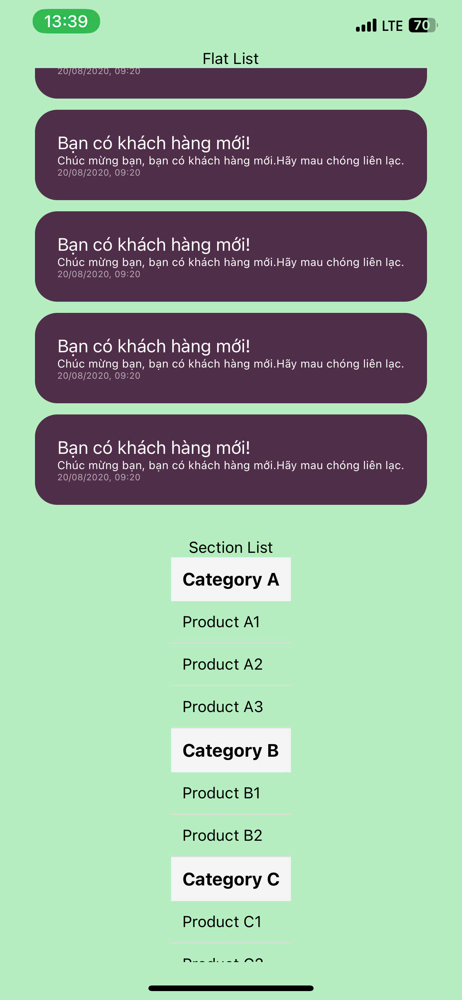

## Nguyễn Văn Tú - 22810310083


# So sánh FlatList và SectionList trong React Native

## 1. Mục đích sử dụng

| **FlatList**                         | **SectionList**                        |
|--------------------------------------|----------------------------------------|
| Dùng để hiển thị danh sách đơn giản và tuyến tính, không có phân nhóm hoặc tiêu đề. | Dùng để hiển thị danh sách được phân nhóm theo từng mục (sections) với tiêu đề cho mỗi nhóm. |
| Ví dụ: Danh sách các bài viết, sản phẩm. | Ví dụ: Danh sách danh bạ được nhóm theo chữ cái, thực đơn nhà hàng theo loại món ăn. |

---

## 2. Cấu trúc dữ liệu

### FlatList
```javascript
const data = [
  { id: '1', title: 'Item 1' },
  { id: '2', title: 'Item 2' },
  { id: '3', title: 'Item 3' }
];
```

### SectionList
```javascript
const sections = [
  {
    title: 'Section 1',
    data: ['Item 1', 'Item 2']
  },
  {
    title: 'Section 2',
    data: ['Item 3', 'Item 4']
  }
];
```

---

## 3. Hiệu năng

| **FlatList**                         | **SectionList**                        |
|--------------------------------------|----------------------------------------|
| **Hiệu năng cao hơn** khi chỉ cần hiển thị danh sách đơn giản, nhờ không cần xử lý thêm logic về sections. | Hiệu năng có thể thấp hơn một chút do cần xử lý và render tiêu đề cho mỗi nhóm (section headers). |
| Cả hai đều hỗ trợ các kỹ thuật như **lazy loading**, **virtualization**, và **infinite scrolling**. | Tuy nhiên, `SectionList` phải xử lý dữ liệu phức tạp hơn, có thể cần tối ưu thêm cho danh sách lớn. |

---

## 4. Tính dễ sử dụng

| **FlatList**                         | **SectionList**                        |
|--------------------------------------|----------------------------------------|
| **Dễ sử dụng hơn** vì chỉ cần một mảng đơn giản, không yêu cầu xử lý dữ liệu phức tạp. | Cần xử lý thêm để định dạng dữ liệu thành các section với tiêu đề và danh sách dữ liệu trong từng nhóm. |
| Không có sẵn tiêu đề (header) cho từng nhóm, cần tự thêm nếu cần. | Có sẵn tiêu đề cho mỗi nhóm, dễ dàng tùy chỉnh qua `renderSectionHeader`. |

### Code mẫu

#### FlatList
```javascript
<FlatList
  data={data}
  keyExtractor={(item) => item.id}
  renderItem={({ item }) => (
    <Text>{item.title}</Text>
  )}
/>
```

#### SectionList
```javascript
<SectionList
  sections={sections}
  keyExtractor={(item, index) => item + index}
  renderItem={({ item }) => (
    <Text>{item}</Text>
  )}
  renderSectionHeader={({ section }) => (
    <Text>{section.title}</Text>
  )}
/>
```

---

## 5. Khi nào sử dụng?

| **FlatList**                         | **SectionList**                        |
|--------------------------------------|----------------------------------------|
| Khi dữ liệu là một danh sách phẳng, không cần nhóm hoặc phân loại. | Khi dữ liệu cần được nhóm và hiển thị theo từng phần (section). |
| Đơn giản và phù hợp với hầu hết các trường hợp cơ bản. | Phù hợp với các trường hợp cần hiển thị dữ liệu phân nhóm như danh bạ, thực đơn, hoặc lịch. |

---

## Kết luận

- **FlatList**: Thích hợp cho các danh sách đơn giản, dễ sử dụng và có hiệu năng tốt hơn khi dữ liệu không quá phức tạp.
- **SectionList**: Dùng khi cần hiển thị danh sách phân nhóm, mạnh mẽ hơn nhưng cần thêm thời gian để xử lý và định dạng dữ liệu.